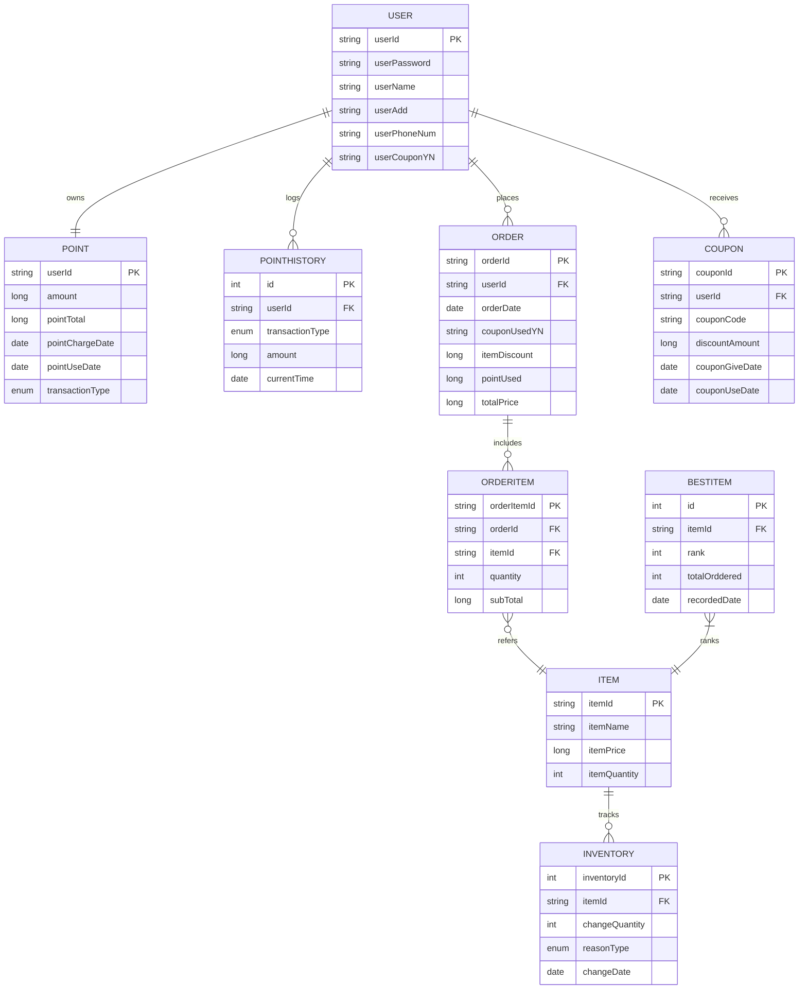

```mermaid
erDiagram
    USER ||--|| POINT : owns
    USER ||--o{ POINTHISTORY : logs
    USER ||--o{ ORDER : places
    ORDER ||--o{ ORDERITEM : includes
    ORDERITEM }o--|| ITEM : refers
    ITEM ||--o{ INVENTORY : tracks
    USER ||--o{ COUPON : receives
    BESTITEM }|--|| ITEM : ranks


%% 엔터티 정의

    USER {
        string userId PK
        string userPassword
        string userName
        string userAdd
        string userPhoneNum
        string userCouponYN
    }

    COUPON {
        string couponId PK
        string userId FK
        string couponCode
        long discountAmount
        date couponGiveDate
        date couponUseDate
    }

    POINT {
        string userId PK
        long amount
        long pointTotal
        date pointChargeDate
        date pointUseDate
        enum transactionType
    }

    POINTHISTORY {
        int id PK
        string userId FK
        enum transactionType
        long amount
        date currentTime
    }

    ITEM {
        string itemId PK
        string itemName
        long itemPrice
        int itemQuantity
    }

    ORDER {
        string orderId PK
        string userId FK
        date orderDate
        string couponUsedYN
        long itemDiscount
        long pointUsed
        long totalPrice
    }

    ORDERITEM {
        string orderItemId PK
        string orderId FK
        string itemId FK
        int quantity
        long subTotal
    }
    
    INVENTORY {
        int inventoryId PK
        string itemId FK
        int changeQuantity  
        enum reasonType        
        date changeDate
    }
    
    BESTITEM {
        int id PK
        string itemId FK
        int rank
        int totalOrddered
        date recordedDate
    }
```