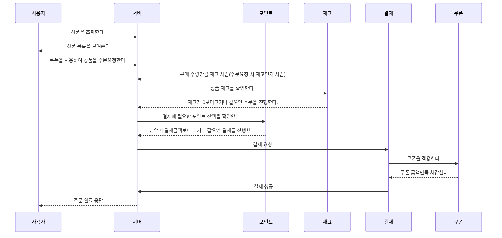

```mermaid
sequenceDiagram
    participant 사용자
    participant 서버
    participant 포인트
    participant 재고
    participant 결제
    participant 쿠폰

    사용자 ->> 서버: 상품을 조회한다
    서버 -->> 사용자: 상품 목록을 보여준다
    사용자 ->> 서버: 쿠폰을 사용하여 상품을 주문요청한다
    재고 ->> 서버: 구매 수량만큼 재고 차감(주문요청 시 재고먼저 차감)
    서버 ->> 재고: 상품 재고를 확인한다
    재고 -->> 서버: 재고가 0보다크거나 같으면 주문을 진행한다.
    서버 ->> 포인트: 결제에 필요한 포인트 잔액을 확인한다
    포인트 -->> 서버: 잔액이 결제금액보다 크거나 같으면 결제를 진행한다
    서버 ->> 결제: 결제 요청
    결제 ->> 쿠폰: 쿠폰을 적용한다
    쿠폰 -->> 결제: 쿠폰 금액만큼 차감한다
    결제 ->> 서버: 결제 성공
    서버 -->> 사용자: 주문 완료 응답
```