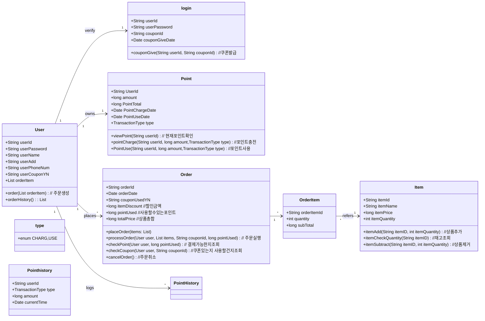

```mermaid 
classDiagram
    direction LR
    class User {
        +String userId
        +String userPassword
        +String userName
        +String userAdd
        +String userPhoneNum
        +String userCouponYN
        +List orderItem
        +order(List orderItem) // 주문생성
        +orderHistory(): List<Order>
    }

    class login {
	    +String userId
	    +String userPassword
	    +String couponId
	    +Date couponGiveDate
	    +couponGive(String userId, String couponId) //쿠폰발급
    }

    class Point {
        +String UserId
        +long amount
        +long PointTotal
        +Date PointChargeDate
        +Date PointUseDate
        +TransactionType type
        +viewPoint(String userId) // 현재포인트확인
        +pointCharge(String userId, long amount,TransactionType type) //포인트충전
        +PointUse(String userId, long amount,TransactionType type) //포인트사용
    }

    class type{
        +enum CHARG,USE
    }
    
    class Pointhistory{
        +String userId
        +TransactionType type
        +long amount
        +Date currentTime
    }

    class Item {
	    +String itemId
	    +String itemName
	    +long itemPrice
	    +int itemQuantity
	    +itemAdd(String itemID, int itemQuantity) //상품추가
	    +itemCheckQuantity(String itemID) //재고조회
	    +itemSubtract(String itemID, int itemQuantity) //상품제거
    }


    class Order {
	    +String orderId
	    +Date orderDate
	    +String couponUsedYN
	    +long itemDiscount //할인금액
	    +long pointUsed //사용할수있는포인트
	    +long totalPrice //상품총합
        +placeOrder(items: List<OrderItem>)
	    +processOrder(User user, List items, String couponId, long pointUsed) // 주문실행
	    +checkPoint(User user, long pointUsed) // 결제가능한지조회
	    +checkCoupon(User user, String couponId) //쿠폰있는지 사용할건지조회
        +cancelOrder() //주문취소
	}

    class OrderItem {
        +String orderItemId
        +int quantity
        +long subTotal
    }

%%사용자가 로그인 할 때 선착순 대상인지 확인
User "1" --> "1" login : verify
%%사용자가 포인트를 사용하여 결제한다.
User "1" --> "1" Point : owns
%%사용자가 포인트 히스토리를 확인 할 수 있다.
User "1" --> "*" PointHistory : logs
%%사용자 주문한다.
User "1" --> "*" Order : places
%%주문은 아이템리스트를 가진다
Order "1" --> "*" OrderItem
%%아이템리스트를 보여준다.
OrderItem "*" --> "1" Item : refers

```